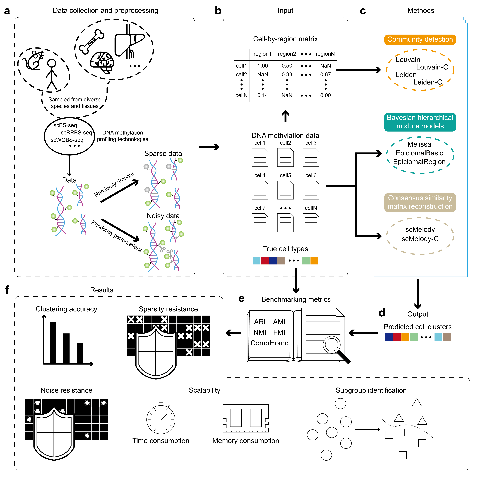

# **Deciphering epigenomic heterogeneity: a systematic benchmark of clustering algorithms for single-cell DNA methylation profiles**

We performed a comprehensive benchmarking analysis of nine widely-used methods for clustering single-cell DNA methylation profiles, encompassing both general-purpose algorithms and tools specifically designed for methylation data. This evaluation offers researchers an in-depth comparison of the available approaches, assisting in the selection of appropriate methods for practical research scenarios. We further hope that this work will inspire future methodological advances and contribute to the continued development of the field.

## Pipeline of our study



The pipeline of our study encompasses six parts: **a** Data collection and preprocessing; **b** Formatting method-specific inputs; **c** Executing clustering methods; **d** Aggregating outputs; **e** Evaluating results using six benchmarking metrics; **f** Analyzing the results. Researchers can follow this pipeline to apply clustering methods to DNA methylation data or to evaluate the performance of such methods.

## Repository description

We provide all scripts required to run and evaluate the methods described in this study, as well as to reproduce the results. The directory structure is organized as follows:

1. The **`methods`** folder includes the source scripts for each method, along with intermediate files containing processed input data. Each method has a dedicated subfolder, with the exception of EpiclomalBasic and EpiclomalRegion, which are integrated within a shared framework.
2. The **`raw_data`** folder includes your raw data for applying clustering methods. To perform or evaluate methods on your own datasets, you need to adjust your datasets' format. Specifically, **`raw_data`** folder needs to contain a `cell_files` folder and `true_clone_membership.txt.gz` file. 

For detailed descriptions of the experimental implementation, please refer to the corresponding sections of our paper.

## Adjustment of your datasets to fit our processing pipeline

Users should place their original datasets in the **`raw_data`** folder. To ensure compatibility with our processing pipeline, the datasets must be structured in the following way:

The **`raw_data`** folder must contain:

- A subfolder named `cell_files`
- A file named `true_clone_membership.txt.gz`

All single-cell data files in `.gz` format should be placed in the `cell_files` folder and must adhere to the format used in the `Farlik2016` dataset. Each `.gz` file should follow a four-column tab-separated format without a header, as shown below:

```
chr7    45282   2   2
chr7    86551   1   1
chr7    108126  0   5
chr7    203233  1   7
```

Each row corresponds to one DNA methylation locus in a single cell, with the columns representing:

1. `chromosome`
2. `position`
3. `methylated reads`
4. `total reads`

> [!IMPORTANT]
>
> - The files must be in **tab-delimited format**.
> - The files **must not include a header row** with the column names.

The `true_clone_membership.txt.gz` file must contain the pre-annotated true cell types in the following format:

```
cell_id epigenotype_id
GSM2324443_CLP_1_D1_10_R1       0
GSM2324444_CLP_1_D1_11_R1       0
GSM2324445_CLP_1_D1_13_R1       0
GSM2324446_CLP_1_D1_14_R1       0
GSM2324497_CMP_1_D2_10_R1       1
GSM2324498_CMP_1_D2_11_R1       1
GSM2324499_CMP_1_D2_12_R1       1
GSM2324502_CMP_1_D2_15_R1       1
```

The columns represent:

1. `cell_id`: the identifier for each cell
2. `epigenotype_id`: the corresponding true cell type label

> [!IMPORTANT]
>
> - The file must be in **tab-delimited format**.
> - Rows must be sorted in **lexicographic ascending order** of the `cell_id` column.
> - The file **must include a header row** with the column names.

We provide `Farlik2016` dataset as an example at [Google Drive](https://drive.google.com/file/d/1iXWYjgpS_Iw1M8FznDKeWYWKxl_3nama/view?usp=drive_link).

## Run methods

Firstly, you need to copy your adjusted `cell_files` folder and `true_clone_membership.txt.gz` file to the `input` folder under **`methods`** folder. We will demonstrate the basic usage of these methods.

### Run Louvain

Please navigate to the `methods/Louvain/` directory. Please modify the `build.py` file to accommodate your input datasets. Specifically, update the following variables to match your data:

- `species` (line 289): Set to either `"HUMAN"` or `"MOUSE"`.
- `mm_refgenome` (line 290).
- `hg_refgenome` (line 291).

If `species` is set to `"HUMAN"`, assign `mm_refgenome = None`; conversely, if `species` is `"MOUSE"`, set `hg_refgenome = None`.

You also need to specify the appropriate genome library for your dataset. For example, the `Farlik2016` dataset uses the `hg38` genome library. Next, execute the following bash command:

```bash
bash run.sh
```

This will run the script and redirect both standard output and standard error to the file `log`. The clustering results and their evaluation based on the six benchmark metrics will be saved as `Louvain.csv` and `Evaluation_Louvain.csv` respectively in the `result` directory.

### Run Louvain-C

Please navigate to the `methods/Louvain-C/` directory. Please modify the `build.py` file to accommodate your input datasets. Specifically, update the following variables to match your data:

- `species` (line 289): Set to either `"HUMAN"` or `"MOUSE"`.
- `mm_refgenome` (line 290).
- `hg_refgenome` (line 291).

If `species` is set to `"HUMAN"`, assign `mm_refgenome = None`; conversely, if `species` is `"MOUSE"`, set `hg_refgenome = None`.

You also need to specify the appropriate genome library for your dataset. For example, the `Farlik2016` dataset uses the `hg38` genome library. For Louvain-C, you need to specify pre-defined number of clusters. Please edit the `run.sh` file and configure the variable `n_clusters` (line 4) to match the number of clusters in your dataset. For example, since the `Farlik2016` dataset contains six cell types, you should set `n_clusters="6"`. Next, execute the following bash command:

```bash
bash run.sh
```

This will run the script and redirect both standard output and standard error to the file `log`. The clustering results and their evaluation based on the six benchmark metrics will be saved as `Louvain-C.csv` and `Evaluation_Louvain-C.csv` respectively in the `result` directory.

### Run Leiden

Please navigate to the `methods/Leiden/` directory. Please modify the `build.py` file to accommodate your input datasets. Specifically, update the following variables to match your data:

- `species` (line 289): Set to either `"HUMAN"` or `"MOUSE"`.
- `mm_refgenome` (line 290).
- `hg_refgenome` (line 291).

If `species` is set to `"HUMAN"`, assign `mm_refgenome = None`; conversely, if `species` is `"MOUSE"`, set `hg_refgenome = None`.

You also need to specify the appropriate genome library for your dataset. For example, the `Farlik2016` dataset uses the `hg38` genome library. Next, execute the following bash command:

```bash
bash run.sh
```

This will run the script and redirect both standard output and standard error to the file `log`. The clustering results and their evaluation based on the six benchmark metrics will be saved as `Leiden.csv` and `Evaluation_Leiden.csv` respectively in the `result` directory.

### Run Leiden-C

Please navigate to the `methods/Leiden-C/` directory. Please modify the `build.py` file to accommodate your input datasets. Specifically, update the following variables to match your data:

- `species` (line 289): Set to either `"HUMAN"` or `"MOUSE"`.
- `mm_refgenome` (line 290).
- `hg_refgenome` (line 291).

If `species` is set to `"HUMAN"`, assign `mm_refgenome = None`; conversely, if `species` is `"MOUSE"`, set `hg_refgenome = None`.

You also need to specify the appropriate genome library for your dataset. For example, the `Farlik2016` dataset uses the `hg38` genome library. For Leiden-C, you need to specify pre-defined number of clusters. Please edit the `run.sh` file and configure the variable `n_clusters` (line 4) to match the number of clusters in your dataset. For example, since the `Farlik2016` dataset contains six cell types, you should set `n_clusters="6"`. Next, execute the following bash command:

```bash
bash run.sh
```

This will run the script and redirect both standard output and standard error to the file `log`. The clustering results and their evaluation based on the six benchmark metrics will be saved as `Leiden-C.csv` and `Evaluation_Leiden-C.csv` respectively in the `result` directory.

### Run Melissa

Please navigate to the `methods/Melissa/` directory. Next, execute the following bash command:

```bash
bash run.sh
```

This will run the script and redirect both standard output and standard error to the file `log`. The clustering results and their evaluation based on the six benchmark metrics will be saved as `Melissa.csv` and `Evaluation_Melissa.csv` respectively in the `result` directory.

### Run EpiclomalBasic and EpiclomalRegion

Please navigate to the `methods/Epiclomal/` directory. Please modify `config.yaml` file and `cpgIslandExt.txt` under `config/process_real_data/` folder. Specifically, for `config/process_real_data/config.yaml` file, update the following variables to match your data:

- `CELL_PATTERN` (line 8): Specify the filename extension of the single-cell files in your `raw_data/cell_files/` folder. For example, if your files are named like `GSM2324994_MPP_1_D4_8_R1.txt.gz`, set `CELL_PATTERN: ".txt.gz"`.
- `GENOME_LIBRARY` (line 15): Specify the genome library corresponding to your dataset. For example, `Farlik2016` datasets belong to `hg38` genome library, then set `GENOME_LIBRARY: 'BSgenome.Hsapiens.UCSC.hg38'`.

For `config/process_real_data/cpgIslandExt.txt` file, you need to download the appropriate CpG island annotation file from [UCSC Genome Browser Downloads](https://hgdownload.soe.ucsc.edu/downloads.html) according to your genome assembly. Let's see an example for `Farlik2016` dataset (`hg38` genome library):

1. Go to the UCSC download page.
2. Select `Human genomes` → `hg38` → `Annotations` → `SQL table dump annotations`.
3. Download `cpgIslandExt.txt.gz`, extract it, and replace the existing file.
4. Add a header to the file with the following columns: `chr`, `start`, `end`. The file should follow this format (tab-delimited):

```
x1 chr start end x5 x6 x7 x8 x9 x10 x11 x12
585     chr1    28735   29737   CpG: 111        1002    111     731     22.2    73      0.85
586     chr1    135124  135563  CpG: 30	439     30      295     13.7    67.2    0.64
586     chr1    199251  200121  CpG: 104        870     104     643     23.9    73.9    0.89
587     chr1    368792  370063  CpG: 99 1271    99      777     15.6    61.1    0.84
```

> [!IMPORTANT]
>
> - The file must be in **tab-delimited format**.
> - The second, third, and fourth columns must be named `chr`, `start`, and `end`, respectively.

Next, execute the following bash command under `methods/Epiclomal/` folder:

```bash
bash run.sh
```

This will run the script and redirect both standard output and standard error to the file `log`. The clustering results and their evaluation based on the six benchmark metrics will be saved as `Epiclomal.csv`, `Evaluation_EpiclomalBasic.csv` and `Evaluation_EpiclomalRegion.csv` respectively in the `result` directory.

### Run scMelody

Please navigate to the `methods/scMelody/` directory. Next, execute the following bash command:

```bash
bash run.sh
```

This will run the script and redirect both standard output and standard error to the file `log`. The clustering results and their evaluation based on the six benchmark metrics will be saved as `scMelody.csv` and `Evaluation_scMelody.csv` respectively in the `result` directory.

### Run scMelody-C

Please navigate to the `methods/scMelody-C/` directory. For scMelody-C, you need to specify pre-defined number of clusters. Please edit the `run.sh` file and configure the variable `n_clusters` (line 4) to match the number of clusters in your dataset. For example, since the `Farlik2016` dataset contains six cell types, you should set `n_clusters="6"`. Next, execute the following bash command:

```bash
bash run.sh
```

This will run the script and redirect both standard output and standard error to the file `log`. The clustering results and their evaluation based on the six benchmark metrics will be saved as `scMelody-C.csv` and `Evaluation_scMelody-C.csv` respectively in the `result` directory.
